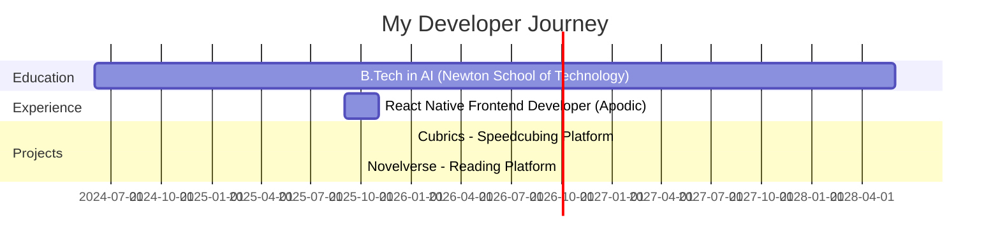

<div align="center">

# 👋 Hi, I'm Junaid Shaik


[](https://linkedin.com/in/yourprofile)
[](https://github.com/mrstrange1708)
[](https://leetcode.com/junaidsamishaik)
[](https://theshaik.tech)
</div>

---

## 🚀 About Me

```typescript
const junaid = {
    code: ["JavaScript", "TypeScript", "Python", "SQL"],
    technologies: {
        frontEnd: {
            js: ["React", "Next.js", "React Native"],
            css: ["Tailwind", "Bootstrap"]
        },
        backEnd: {
            js: ["Node.js", "Express.js"],
            databases: ["MongoDB", "MySQL", "Prisma ORM"]
        },
        aiMl: {
            libraries: ["Pandas", "NumPy", "TensorFlow", "Scikit-learn"],
            focus: ["Machine Learning", "Deep Learning", "NLP", "Computer Vision"]
        },
        devOps: ["Docker", "GitHub Actions", "AWS"],
        tools: ["Git", "Supabase", "Postman"]
    },
    architecture: ["Microservices", "RESTful APIs", "WebSocket", "MVC"],
    currentFocus: "Building AI-powered full-stack applications",
    achievements: {
        leetcode: "1600+ rating | 450+ problems solved",
        codeforces: "950+ rating",
        opensource: "HacktoberFest Super Contributor 🌟"
    }
};
```

---

## 🛠️ Tech Arsenal

<div align="center">

### 💻 Languages & Frameworks


### 🤖 AI/ML & Data Science


### 🗄️ Databases & Backend


### ☁️ DevOps & Tools


### 🎨 Frontend & Styling


</div>

---

## 🎯 Featured Projects

<div align="center">

<table>
<tr>
<td width="50%">

### 🎲 Cubrics
**Production-ready Speedcubing Platform**

[](https://github.com/yourrepo)
[](https://demo.com)

- 🔷 **Next.js** + **TypeScript** + **Three.js**
- 🎮 Interactive 3D Rubik's Cube solver with Kociemba algorithm
- 💬 Real-time WebSocket chat for speedcubing community
- 🏆 Competition tracking and social features

**Tech:** `Next.js` `TypeScript` `Three.js` `WebSockets` `Prisma`

</td>
<td width="50%">

### 📚 Novelverse
**Scalable Reading Platform**

[](https://github.com/yourrepo)
[](https://demo.com)

- ⚡ Sub-second PDF rendering with optimized server-side components
- 🔐 Secure JWT authentication & activity tracking
- 📊 Trending content & personalized user journeys
- 🎯 Zero-downtime access with consistent performance

**Tech:** `Next.js` `TypeScript` `Prisma` `MySQL` `JWT`

</td>
</tr>
</table>

</div>

---

## 📊 GitHub Analytics

<div align="center">


</div>

### Contribution Graph


</div>

---

## 🏆 Competitive Programming

<div align="center">

| Platform | Rating | Problems Solved |
|----------|--------|-----------------|
| 🟨 **LeetCode** | 1600+ | 450+ |
| 🟦 **Codeforces** | 950+ | Active |
| 🌟 **HacktoberFest** | Super Contributor | 2024 |

[](https://leetcode.com/junaidsamishaik)

</div>

---

## 💼 Professional Experience



### 🔹 React Native Frontend Developer @ Apodic Software Solutions
*September 2025 - November 2025*

- 🚀 Contributed to 10,000+ line React Native codebase
- 🔐 Implemented Google Authentication for seamless user experience
- 🎨 Developed refined UI components with robust API integration
- ⚡ Optimized API workflows and enhanced application reliability

---

## 📈 Current Focus

<div align="center">

```
🎯 Building AI-powered full-stack applications
🤖 Exploring Machine Learning & Deep Learning
🚀 Contributing to open-source projects
💡 Solving complex algorithmic problems
🌐 Creating scalable, production-ready solutions
```

</div>

---

## 📫 Let's Connect

<div align="center">

[](mailto:shaik.sami2024@nst.rishihood.edu.in)
[](https://linkedin.com/in/shaik-mohammed-junaid-sami-20885430b)
[](https://github.com/mrstrange1708)
[](https://leetcode.com/junaidsamishaik)
[](https://theshaik.tech)

**💬 Open to collaborations, freelance projects, and interesting opportunities!**

</div>

---

<div align="center">

### ⚡ Fun Fact

*"I turn coffee into code and bugs into features! ☕️→💻"*


**Thanks for visiting! Happy coding! 🚀**

</div>

---

<div align="center">
  
</div>
